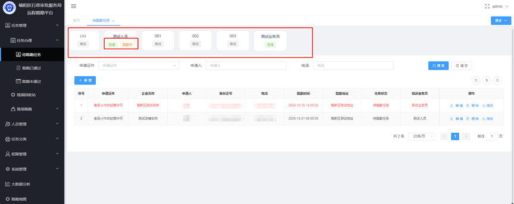
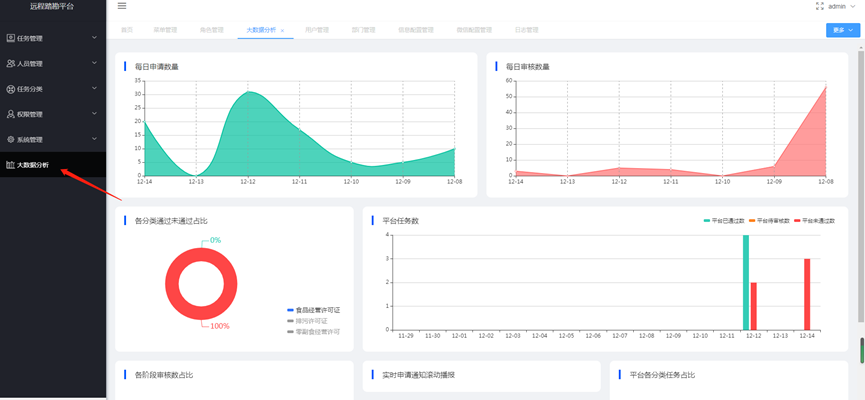

1 引言

1.1 编写目的
本文档旨在对《榆阳区行政审批服务局远程踏勘系统》的功能及操作方法进行描述，帮助用户掌握该系统的使用方法。

1.2 适用对象
本文档适用于测试人员、管理人员等使用该系统的操作人员。

1.3 通用操作说明
【搜索】按钮：查询符合条件的信息。
【添加】按钮：打开新建窗口，新建相应类型的信息。
【修改】按钮：打开修改窗口，修改并保存当前数据行的详细信息。
【删除】按钮：删除当前数据行，删除时会有相应提示操作。
【导出】按钮：导出当前已选中的数据。

2 系统运行环境需求

硬件运行环境包括服务器硬件环境、客户端计算机硬件配置环境，详见下表。
表2.1-1 客户端计算机软硬件配置环境
配置	硬件规格要求
处理器	双核2.0G以上
内存	2G以上
硬盘	100G以上
显示器	分辨率：1920*1080；显示比例：100%
浏览器	谷歌浏览器；显示比例：100%

3 管理端系统功能介绍

3.1 管理端登录
在浏览器地址栏中输入管理端系统的访问地址，进入登录界面。在用户名框、密码框输入正确的用户登录名和密码，单击登录按钮即可登录本系统。系统将根据用户的身份及权限范围进入相应的系统主界面，若用户名、密码输入错误，或者不输入用户名、密码，则不能登录本系统。如图所示：
 
3.2 首页
系统登录成功后即可进入系统首页，首页为展示系统数据内容，分为上下两部分，上半部分为系统各项数据量如：平台任务数、待审核数、已审核数、未通过数、平台业务员数、今日参与业务员数、今日审核数、今日未通过数；下半部分为今日踏勘记录列表，如图所示：
 

3.3  任务办理
管理员可在任务管理-任务办理菜单下的三个子菜单页面中操作踏勘任务，如图所示：
 

3.3.1 待踏勘任务
待踏勘任务页面上方显示了系统中所有的业务员的在线状态和动态，如图所示：
 

3.3.1.1 新增
待踏勘任务页面可进行新增踏勘任务操作，点击新增按钮即可打开新增任务的对话窗口，在窗口合法输入必填项后，点击保存按钮，任务将会添加成功，如图所示：
 

踏勘任务新增成功之后，列表中会出现新添加的数据，与此同时相对应的商户小程序端也会展示该项踏勘任务数据，如图所示：
 
 
3.3.1.2 编辑远程踏勘任务
待踏勘列表中，管理员可对任务进行编辑修改操作，点击该条数据后的编辑按钮即可打开，任务的编辑对话框，在对话框中修改后点击修改按钮即可，如图所示：
 
 
3.3.1.3 删除远程踏勘任务
待踏勘任务列表中，管理员可对任务进行删除操作。点击操作栏中的删除按钮，出现删除询问对话框，点击对话框内的确定按钮即可删除该项数据，如图所示：
 
 
3.3.1.4 指派
待踏勘任务页面中，管理员可对还未指派业务员的任务进行指派分配任务，点击操作栏中的指派按钮即可弹出指派业务员的对话框，仅需在指派业务员处选择需要指派的业务员即可，如图所示：
 
 
指派完成后，被指派分配任务的业务员会受到一条分配任务的短信，短信内容为：您好，您有一条“{踏勘事项名称}”的远程踏勘任务，预计在{踏勘时间}开始，请准时开始。如有问题请及时与管理员联系。如图所示：

 
3.3.2 业务员-任务中心
管理员指派业务员任务完成后，该业务员可使用自己的帐号及密码登陆系统，在任务中心页面可查询到管理员分配给自己的踏勘任务，如图所示：
 
3.3.2.1 业务员任务中心-今日完成踏勘任务占比
今日完成踏勘任务占比为饼图分割显示数据，当鼠标光标移动至某个数据块上时，该数据会高亮显示，如图所示：
 
3.3.2.2 业务员任务中心-我的踏勘记录
我的踏勘记录列表，记载了该业务员所有的踏勘审核记录，列表上方可根据相应的筛选条件进行数据筛选查询，如图所示：
 
我的踏勘记录列表操作栏中，业务员可点击查看详情按钮进入该任务的踏勘详情页，如图所示：
 
 
踏勘任务详情页面中，业务员可点击踏勘信息中的导出按钮即可导出该踏勘任务的详情Excel详情，如图所示：
 
 
踏勘任务详情页，踏勘视频记录列表支持下载和回放功能，可惦记下载或者回放按钮即可实现下载视频和回看视频的需求，如图所示：
 
业务员任务中心页面，待踏勘任务为该业务员即将开始踏勘的数据，点击开始踏勘按钮，业务员将进入视频通话页面，如图所示：
 
 
当业务员进入视频通话页面后，商户也会收到相应的短信和微信服务通知，商户通过小程序进入房间后即可开始视频踏勘，如图所示：
 
业务员在和商户进行视频踏勘过程中可对审核项进行审核和视频截图，也可点击视频右上角的截图按钮进行非审核项截图，如图所示：
 

 
当业务员将所有的审核项审核完成后，可点击提交按钮提交审核如图所示：
 
3.3.3 踏勘已通过
踏勘已通过页面显示了，已经通过了踏勘任务的所有数据，页面上方为筛选查询，下方为数据列表，如图所示：
 
踏勘已通过页面，管理员可点击操作栏中的查看详情按钮，进入踏勘详情页面，如图所示：
 
 
管理员在查看踏勘详情页面时，管理员可在踏勘视频记录列表中将视频删除，删除确认后，被删除的视频会放在视频回收站中。如图所示：
 
 

3.4 视频回收站
管理员点击任务管理-视频回收站即可进入视频回收站页面，如图所示：
 
视频在回收站内仅保存7天，超出7天将自动删除，7天内在回收站列表中可以点击回看按钮或者还原按钮进行回放查看和还原视频，如图所示：
 
3.5 现场踏勘

3.5.1 待指派
踏勘已通过的任务有几率（系统配置）被抽中现场踏勘，点击现场踏勘-待指派菜单即可进入待指派页面，如图所示：
 
3.5.1.1 删除
点击列表操作栏中的删除按钮，会弹出询问确认删除的对话框，点击对话框内的确定按钮即可删除成功，如图所示：
 
 
3.5.1.2 指派
点击列表操作栏中的指派按钮，即可弹出现场踏勘指派的对话框，选择相应的踏勘时间和业务员后点击提交按钮即可指派成功，如图所示：
 
 

3.5.2 待踏勘

3.5.2.1 删除
点击列表中的删除按钮即可弹出删除询问的对话框，点击对话框内确定按钮即可删除，如图所示：
 
 
3.5.2.2 指派
点击列表操作栏中的指派按钮，即可弹出现场踏勘指派的对话框，选择相应的踏勘时间和业务员后点击提交按钮即可指派成功，如图所示：
 
 
3.5.2.3 登记结果
点击操作栏中的登记结果按钮，即可打开登记结果对话框，在框内合法输入必填项后点击提交按钮即可完成登记，如图所示：
 
 
3.5.3 已踏勘

3.5.3.1 删除
点击已踏勘列表操作栏中的删除按钮，即可弹出询问删除的对话框，点击对话框内的确定按钮即可删除成功，如图所示：
 
 
3.5.3.2 查看详情
点击操作栏中的查看详情按钮即可打开现场踏勘任务的详情页，如图所示：
 
 
在踏勘详情的踏勘信息框内，如远程踏勘为通过，但现场踏勘为未通过，那么踏勘信息依然是未通过，如图所示：
 
在详情页面点击核查信息下的现场踏勘选项卡，即可展示现场踏勘信息，如图所示：
 
	
3.6 申请人管理
管理员可在人员管理-申请人管理页面对申请人进行筛选查询和操作，如图所示：
 

3.6.1 编辑申请人信息
点击列表中的编辑按钮，即可弹出编辑申请人的对话框，在对话框中可对申请人的基本信息进行编辑修改，修改完成后点击修改按钮即可，如图所示：
 
 
3.6.2 删除申请人
点击列表中的删除按钮，系统会弹出询问删除的对话框，点击对话框内的确定按钮即可删除申请人，如图所示：
 
 
3.7 分类管理
管理员可在任务分类-分类管理页面进行新增、编辑、删除、设置审批细则等操作，如图所示：
 
3.7.1 新增分类
点击分类管理页面的新增按钮，即可弹出新增分类的对话框，如图所示：
 
 
新增弹框中的所有输入项均为必填项，输入完成后点击保存按钮即可添加分类成功，如图所示：
 

3.7.2 编辑修改分类
点击分类管理列表中的编辑按钮即可弹出编辑修改的对话框，编辑修改完成后点击修改按钮即可，如图所示：
 
 
3.7.3 删除分类
点击分类管理列表中的删除按钮即可弹出确认删除的弹框，点击弹框内的确定按钮即可删除分类，如图所示：
 
 
3.7.4 审批项设置
点击分类管理列表中的审批细则按钮即可弹出审批细则对话框，点击对话框中的新增按钮即可打开新增审批项的对话框，如图所示：
 
 
 
在新增输入框内输入完成之后点击保存按钮即可设置成功，如图所示：
  
3.8 行政事务管理
管理员可在任务分类-行政事务管理页面进行新增、编辑、删除事务等操作，如图所示：
 

3.8.1 新增事务
点击行政事务管理页面的新增按钮即可弹出新增对话框，对话框内所有输入项均为必填项，输入完成后点击保存按钮即可新增成功，如图所示：
 
 
3.8.2 编辑修改事务
点击事务列表中的编辑按钮即可弹出编辑修改的对话框，修改完成后点击修改按钮即可修改成功，如图所示：
 
 
3.8.3 删除事务
点击事务列表中的删除按钮即可弹出确认删除的对话框，点击对话框内的确定按钮即可删除事务，如图所示：
 
 
3.9 用户管理
管理员可在权限管理-用户管理页面进行添加、编辑、删除用户等操作，如图所示：
 

3.9.1 用户添加
点击用户管理列表上的添加按钮即可弹出新增用户的对话框，对话框内输入完输入项后点击保存按钮即可添加成功，用户添加成功后即可登录系统，如图所示：
 
 
3.9.2 编辑修改用户信息
点击用户管理列表上的添加按钮即可弹出用户的编辑页面，修改完成后点击修改按钮即可修改编辑完成，如图所示：
 
 
3.9.3 删除用户
点击用户管理列表上的删除按钮即可弹出询问删除的对话框，点击对话框内得确定按钮即可删除成功，如图所示：
 
 
3.10 菜单管理
管理员可在权限管理-菜单管理页面进行系统菜单的添加、修改、删除等操作，如图所示：
 
3.10.1 新增菜单
点击菜单管理列表上的新增按钮即可弹出新增对话框，输入完成后点击确定按钮即可添加成功，如图所示：
 
 
3.10.2 修改菜单
点击菜单管理列表中的修改按钮即可弹出修改菜单的对话框，修改输入完成后点击确定按钮即可修改完成，如图所示：
 
 
3.10.3 删除菜单
点击菜单管理列表中的删除按钮即可弹出删除询问的对话框，点击对话框内的确定按钮，即可删除菜单，如图所示：
 
 
3.11 角色管理
管理员可在权限管理-角色管理页面中对角色进行添加、查看、编辑、删除、设置权限等操作，如图所示：
 
3.11.1 添加角色
点击角色管理页的添加按钮即可打开新增角色的对话框，在对话框内输入完成后点击保存按钮即可添加成功，如图所示：
 
 
3.11.2 查看角色
点击角色管理列表中的查看按钮即可弹出角色信息的对话框，如图所示：
 
 
3.11.3 编辑角色
点击角色管理列表中的编辑按钮即可弹出角色的编辑对话框，对话框内修改完成后点击修改按钮即可编辑完成，如图所示：
 
 
3.11.4 删除角色
点击角色管理列表中的删除按钮即可弹出确认删除的对话框，点击对话框内的确定即可删除角色，如图所示：
 
 
3.11.5 分配权限
点击角色管理列表中的权限按钮即可弹出分配权限的对话框，对话框内勾选相应的权限，点击更新按钮即可分配权限成功，如图所示：
 
 
3.12 大数据分析
点击系统菜单中的大数据分析菜单即可进入大数据分析页面，如图所示：
 

3.13 现场踏勘配置
点击系统管理-现场踏勘配置菜单，即可进入现场踏勘配置页面，在该页面可以手动更改现场踏勘抽查概率，点击输入输入框输入1-100，然后点击更新即可，如图所示：
 

3.14 踏勘地图
管理员点击踏勘地图菜单即可进入踏勘地图页面，默认为卫星地图展示，如图所示：
 
点击地图右上角的地图和卫星切换按钮，即可实现普通地图和卫星地图的展示切换，如图所示：
 
 
当鼠标光标在地图上时，可滑动鼠标滑轮进行放大或缩小地图，也可点击或滑动地图左上角的放大缩小按钮和进度条，实现地图的放大和缩小区域查看，如图所示：
 

如需查看演示系统请联系客服.png)